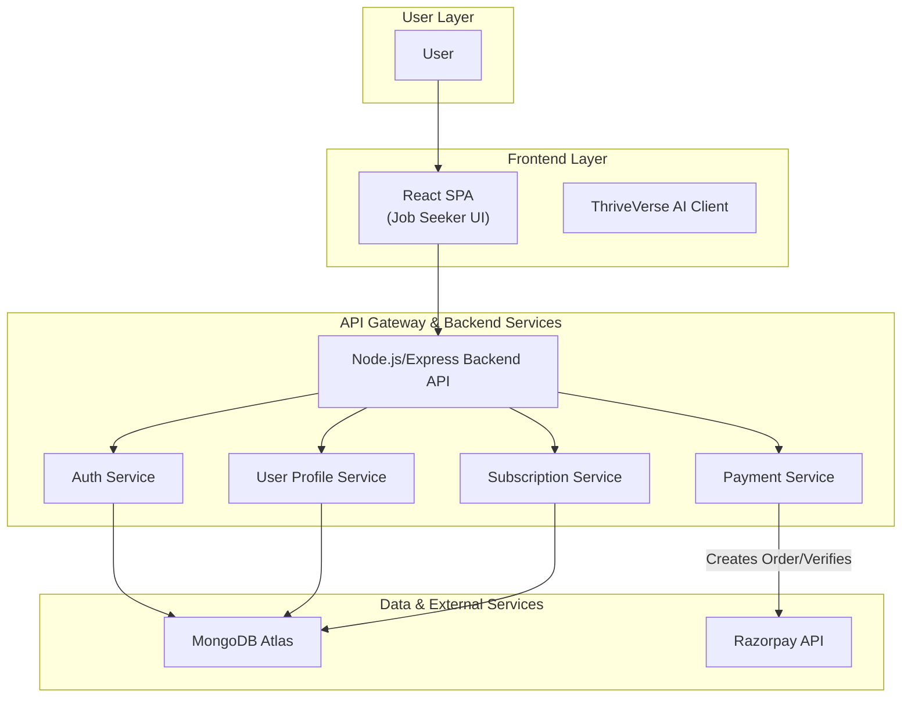

# Job Seeker & Email Outreach Platform

A highly concurrent, event-driven backend system designed to power a multi-tenant job seeker application. The system provides robust APIs for user management, subscription handling, and payment processing, engineered to support thousands of concurrent users and high-volume transactional workloads.

# 2. System Architecture & Data Flow

The system is designed as a decoupled, service-oriented architecture. The frontend is a React-based single-page application that communicates with a Node.js backend API. Data is persisted in MongoDB, and payment processing is handled by integrating with Razorpay.



### Lifecycle of a Core Request (Subscription Creation)

1.  **Initiation:** A logged-in user on the **React SPA** selects a subscription plan and initiates the payment process.
2.  **Order Creation:** The frontend sends a `POST /api/subscriptions/orders` request to the **Node.js Backend API**. The request is authenticated via a JWT token.
3.  **Payment Gateway Interaction:** The **Subscription Service** invokes the **Razorpay API** to create a payment order, receiving an `order_id`. This `order_id` is returned to the client.
4.  **Client-Side Payment:** The frontend uses the `order_id` to open the Razorpay payment modal. The user completes the payment.
5.  **Payment Verification (Idempotency):** Upon successful payment, the frontend sends a `POST /api/subscriptions/verify-payment` request to the backend, including the payment signature and order details. The **Payment Service** verifies this signature with Razorpay to confirm the transaction's authenticity and prevent replay attacks.
6.  **Data Persistence:** Once verified, the user's subscription status is updated in the **MongoDB** database.

# 3. System Design Principles & Trade-offs

### Scalability & Concurrency
- **Stateless Backend:** The Node.js API is stateless, allowing for horizontal scaling behind a load balancer. Authentication is handled by JWTs, eliminating the need for server-side session storage.
- **Asynchronous I/O:** Leveraging Node.js's event-driven, non-blocking I/O model to handle a high number of concurrent connections efficiently, especially for I/O-bound operations like database queries and external API calls.
- **Connection Pooling:** The Mongoose ODM manages a pool of connections to the MongoDB database, reducing the latency of database queries by reusing existing connections.

### Fault Tolerance & Reliability
- **Graceful Error Handling:** A centralized error-handling middleware catches and logs unexpected errors, preventing server crashes and returning standardized `500` responses to the client.
- **Input Validation:** `express-validator` is used on API routes to sanitize and validate incoming payloads, protecting the system from malformed data and potential injection attacks.
- **Security Headers:** `helmet` middleware is used to set various HTTP headers (e.g., `X-Content-Type-Options`, `Strict-Transport-Security`), mitigating common web vulnerabilities like XSS and clickjacking.

### Data Consistency & Idempotency
- **Database Choice (NoSQL):** MongoDB was chosen for its flexible schema, which is ideal for storing user profiles and varied application data. Its scalability features are well-suited for a growing user base.
- **Payment Verification:** The two-step payment process (create order, then verify) ensures that a subscription is only marked as active after the payment has been cryptographically verified by the backend. This makes the payment confirmation process idempotent and secure.
- **Stateless Authentication:** JWTs (`jsonwebtoken`) provide a secure and scalable method for authenticating API requests without maintaining server-side state.

# 4. Tech Stack (Categorized)

- **Backend Core:**
  - **Node.js & Express:** High-performance, non-blocking I/O for scalable network applications.
  - **bcryptjs:** Securely hashing user passwords for storage.
  - **jsonwebtoken (JWT):** Compact, self-contained tokens for stateless authentication.
- **Data Storage:**
  - **MongoDB:** Scalable NoSQL database for flexible and fast data access.
  - **Mongoose:** Elegant object data modeling (ODM) for MongoDB in Node.js.
- **Frontend:**
    - **React:** Component-based UI library for building single-page applications.
    - **Redux Toolkit:** State management for predictable and scalable frontend logic.
    - **Material-UI (MUI):** UI component library for a consistent and professional look and feel.
- **Payment Integration:**
  - **Razorpay:** External API for processing payments in the Indian market.
- **Development & Tooling:**
  - **Nodemon:** Automatic server restarts during development.
  - **CORS:** Manages cross-origin resource sharing between frontend and backend.

# 5. API Contracts & Data Models

### API Example: User Registration

**Request:** `POST /api/users/register`
```json
{
  "name": "John Doe",
  "email": "john.doe@example.com",
  "password": "securepassword123"
}
```

**Response:** `201 Created`
```json
{
  "token": "<JWT_TOKEN_PLACEHOLDER>"
}
```

### Core Data Model (User Schema)

A simplified representation of the Mongoose User schema.

```javascript
const userSchema = new mongoose.Schema({
  name: { type: String, required: true },
  email: { type: String, required: true, unique: true },
  password: { type: String, required: true },
  subscription: {
    plan: { type: String, enum: ['basic', 'premium', 'none'] },
    status: { type: String, enum: ['active', 'inactive', 'cancelled'] },
    endDate: { type: Date }
  }
}, { timestamps: true });
```

# 6. Deployment & CI/CD Strategy

- **Infrastructure:** The backend is designed to be containerized using **Docker** and deployed to a managed cloud service like **AWS Fargate** or **Google Cloud Run** for automated scaling and high availability.
- **CI/CD Pipeline (GitHub Actions):**
  1.  **On Push/PR to `main`:** A workflow is triggered.
  2.  **Lint & Test:** The codebase is linted, and automated tests are run.
  3.  **Build Docker Image:** A new Docker image for the backend is built and pushed to a container registry (e.g., Docker Hub, GCR).
  4.  **Deploy:** The new image is deployed to the production environment, enabling zero-downtime updates.
  5.  The frontend applications (`frontend` and `thriveVerseAI`) are deployed as static sites to services like Netlify, Vercel, or AWS S3/CloudFront.

# 7. Local Setup & Run Instructions

### Prerequisites
- Node.js (v18+)
- MongoDB instance (local or cloud-hosted)

### 1. Backend Setup

```bash
# Navigate to the backend directory
cd backend

# Install dependencies
npm install

# Create a .env file from the example
cp .env.example .env
```
**Update `.env` with your credentials:**
```
MONGODB_URI=<Your_MongoDB_Connection_String>
JWT_SECRET=<Your_JWT_Secret>
RAZORPAY_KEY_ID=<Your_Razorpay_Key_ID>
RAZORPAY_KEY_SECRET=<Your_Razorpay_Key_Secret>
```

```bash
# Start the development server
npm run dev
```

### 2. Frontend Setup

```bash
# Navigate to the frontend directory
cd ../frontend

# Install dependencies
npm install

# Create a .env file from the example
cp .env.example .env
```
**Update `.env` to point to your local backend:**
```
REACT_APP_API_URL=http://localhost:5000/api
```

```bash
# Start the React development server
npm start
```
The application will be available at `http://localhost:3000`.
